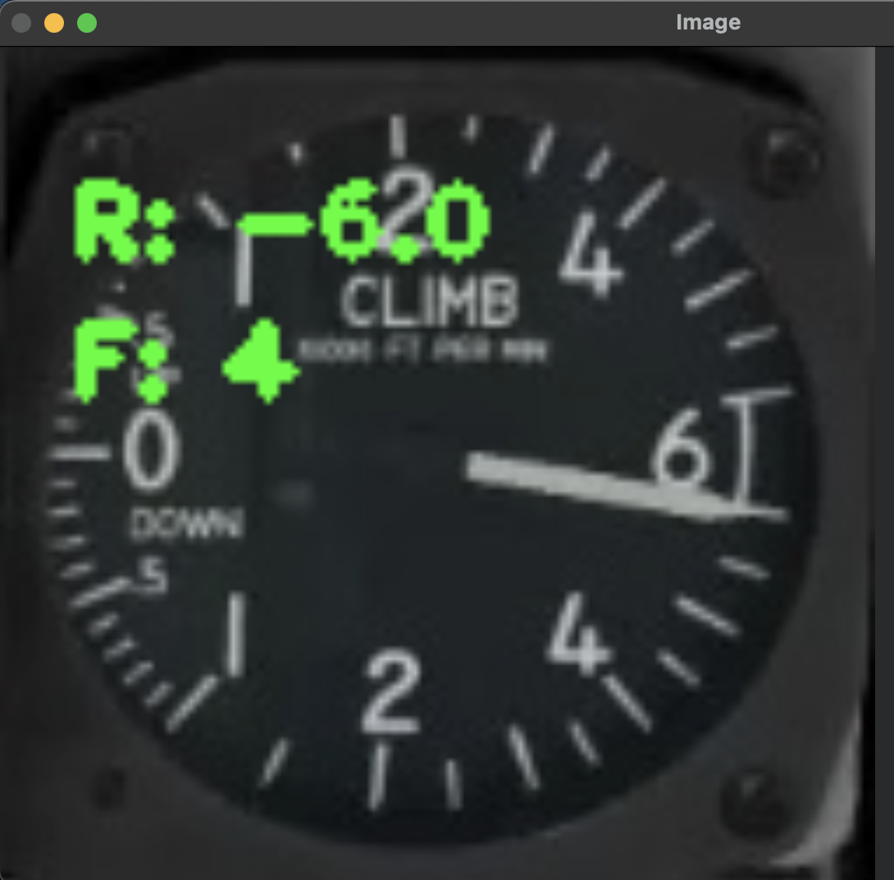
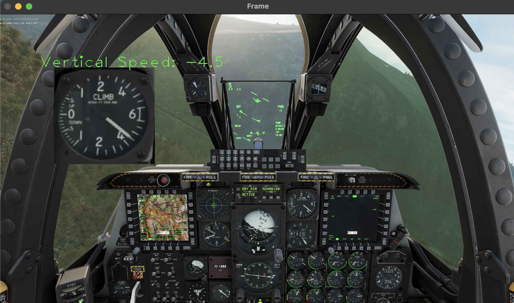

# instrument-identifier

This project aims to create a system capable of reading instruments from a simulated aircraft cockpit. It will take a video feed from a simulator and apply one or more machine vision processes to read values from a set of target instruments.

## Why?

Pilots in training may want to verify how they are reading an aircraft’s instruments, users of flight simulators might want to record information about their flight but don’t have access to developer APIs, and video streaming services such as Twitch could use this to collect additional information about what a streamer is doing. And it's fun :)

## Release 1: October 16th 2023

This release is intended to be a quick prototype of the entire project end-to-end. To simplify:

- The input video has a fixed perspective - the instruments are therefore always within a certain region
- Only the vertical speed indicator is evaluated

### Extract Frames

This is a simple helper for extracting all of the frames in an input video and cropping them down to a specific region. I use this to generate hundreds of images of instruments for training models.
  
### Label Frames

This is a tool for labelling each of the frames generated by the frame extractor. We have to assign a value to each frame representing the instrument reading. This will be used to train the deep learning model to read instruments.
  
Because the input is a video of an aircraft flying, the changes in instrument reading from frame-to-frame are relatively small. This tool makes it easy to quickly increment or decrement the labelling value by a predefined step, then apply this to any number of frames. It takes about 10 minutes for a person to label 1000 frames, which is enough to train a relatively accurate model.

  
TODO:  
- Better support for viewing/editing frames that have already been edited. 

### Train Deep Learning Model

This tool uses tensorflow to train a model from a directory of training frames and a CSV of labels. The hyperparameters for the model are relatively standard in this verison, they can be further improved in later releases.
  
Current accuracy for vertical speed readings is 90%.  
  
TODO:  
- Adjust hyperparameters and attempt to improve accuracy

### Evaluate Deep Learning Model

To provide a visual output of the system, this tool displays frames of the input video along with a scaled-up image of the vertical speed indicator and the model's interpretation of its value. This allows a user to identify patterns in the model's accuracy, as well as providing a "real-life" example of the system working.

TODO:
- Provide a visual representation of the aircraft and its attitude/speed/etc based on the model's interpretation of the instrument(s).

---
## Release 2: October 20th 2023

This release significantly improved a number of the prototype-quality tools used to generate the first model.

## Extract Frames

This tool has been simplfiied to a function call. Since it needs quite a bit of tweaking the first time it's run I've kept separate cells for each instrument and added a "limit" parameter which allows for a single frame to be generated instead of the entire video. 

## Label Frames

This tool has been completely overhauled. It now allows you to step through each training frame, forward or backward, and view the existing label without overwriting. This allows for editing of existing labels, and quick corrections if an incorrect value is entered. It saves the entire CSV after each frame ensuring that data loss is minimal in a crash. It also has handling for missing frames that have labels and other edge cases.

## Read Airspeed

This is essentially a copy of the evaluation tool built for vertical speed in the last update. It displays each frame of a video feed along with a scaled-up overlay of the airspeed indicator. 

TODO:
- Combine these into a single evaluation tool that supports any number of instruments being evaluated at once
- Potentially allow for stepping backwards in the video frames (create buffer?)
- Perform labelling on some input videos. Graph the difference between the model's evaluation and the actual reading to determine how significant deviations are.

## Feature Matching

This is a currently unsuccessful experiment to see if feature matching can be used to identify the position of an instrument onscreen. It takes a single image of an instrument and a full cockpit image as input, then displays the features identified. Currently there is not a significantly greater number of features being identified on the target instrument than elsewhere in the cockpit, likely because of similiarities in the designs of each instrument. This may be refined in future updates to improve results, or dropped for another method.

## New Models

Three models have now been trained for instrument evaluation:

1. The original vertical speed model
2. An improved vertical speed model (Supports +4 through +6, higher accuracy overall)
3. A preliminary airspeed model

The vertical speed model provides very accurate results, and when the model differs from the actual value it tends to be by the smallest possible increment. The airspeed model is more challenging as two pointers are present on the same gauge, one representing current airspeed and the other representing maximum allowable airspeed. The model is accurate 95% of the time, but when it's wrong it usually evaluates the maximum allowable airspeed causing a huge jump in measured airspeed. This would be consequential if these values were used to model the aircraft's attitude/speed/position etc.

TODO:
- Attempt to improve the accuracy of the airspeed model using image preprocessing
- Consider other systems, such as fuzzy logic, which might detect a large deviation in speed and ignore the current frame's reading.

