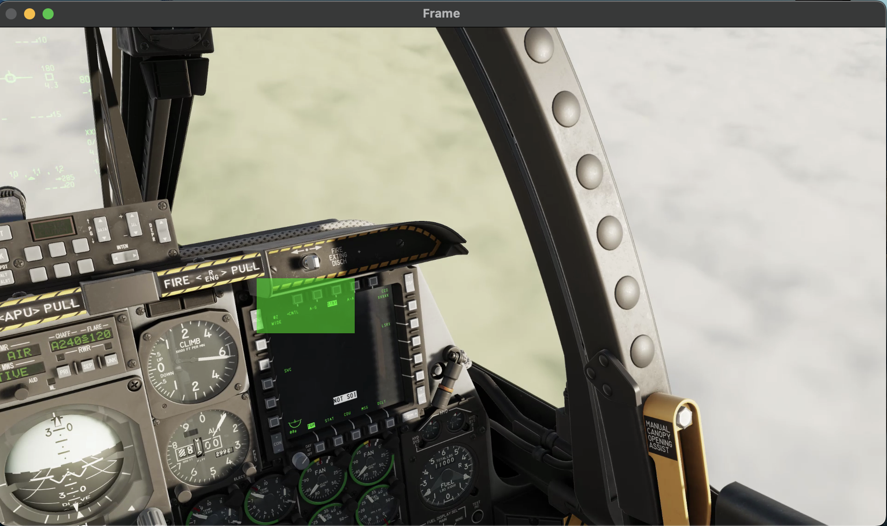

# instrument-identifier

This project aims to create a system capable of reading instruments from a simulated aircraft cockpit. It will take a video feed from a simulator and apply one or more machine vision processes to read values from a set of target instruments.

## Why?

Pilots in training may want to verify how they are reading an aircraft’s instruments, users of flight simulators might want to record information about their flight but don’t have access to developer APIs, and video streaming services such as Twitch could use this to collect additional information about what a streamer is doing. And it's fun :)

## Release 1: October 16th 2023

This release is intended to be a quick prototype of the entire project end-to-end. To simplify:

- The input video has a fixed perspective - the instruments are therefore always within a certain region
- Only the vertical speed indicator is evaluated

### Extract Frames

This is a simple helper for extracting all of the frames in an input video and cropping them down to a specific region. I use this to generate hundreds of images of instruments for training models.
  
### Label Frames

This is a tool for labelling each of the frames generated by the frame extractor. We have to assign a value to each frame representing the instrument reading. This will be used to train the deep learning model to read instruments.
  
Because the input is a video of an aircraft flying, the changes in instrument reading from frame-to-frame are relatively small. This tool makes it easy to quickly increment or decrement the labelling value by a predefined step, then apply this to any number of frames. It takes about 10 minutes for a person to label 1000 frames, which is enough to train a relatively accurate model.


  
TODO:  
- Better support for viewing/editing frames that have already been edited. 

### Train Deep Learning Model

This tool uses tensorflow to train a model from a directory of training frames and a CSV of labels. The hyperparameters for the model are relatively standard in this verison, they can be further improved in later releases.
  
Current accuracy for vertical speed readings is 90%.  
  
TODO:  
- Adjust hyperparameters and attempt to improve accuracy

### Evaluate Deep Learning Model

To provide a visual output of the system, this tool displays frames of the input video along with a scaled-up image of the vertical speed indicator and the model's interpretation of its value. This allows a user to identify patterns in the model's accuracy, as well as providing a "real-life" example of the system working.


TODO:
- Provide a visual representation of the aircraft and its attitude/speed/etc based on the model's interpretation of the instrument(s).

---
## Release 2: October 20th 2023

This release significantly improved a number of the prototype-quality tools used to generate the first model.

## Extract Frames

This tool has been simplfiied to a function call. Since it needs quite a bit of tweaking the first time it's run I've kept separate cells for each instrument and added a "limit" parameter which allows for a single frame to be generated instead of the entire video. 

## Label Frames

This tool has been completely overhauled. It now allows you to step through each training frame, forward or backward, and view the existing label without overwriting. This allows for editing of existing labels, and quick corrections if an incorrect value is entered. It saves the entire CSV after each frame ensuring that data loss is minimal in a crash. It also has handling for missing frames that have labels and other edge cases.


## Read Airspeed

This is essentially a copy of the evaluation tool built for vertical speed in the last update. It displays each frame of a video feed along with a scaled-up overlay of the airspeed indicator. 

TODO:
- Combine these into a single evaluation tool that supports any number of instruments being evaluated at once
- Potentially allow for stepping backwards in the video frames (create buffer?)
- Perform labelling on some input videos. Graph the difference between the model's evaluation and the actual reading to determine how significant deviations are.

## Feature Matching

This is a currently unsuccessful experiment to see if feature matching can be used to identify the position of an instrument onscreen. It takes a single image of an instrument and a full cockpit image as input, then displays the features identified. Currently there is not a significantly greater number of features being identified on the target instrument than elsewhere in the cockpit, likely because of similiarities in the designs of each instrument. This may be refined in future updates to improve results, or dropped for another method.

## New Models

Three models have now been trained for instrument evaluation:

1. The original vertical speed model
2. An improved vertical speed model (Supports +4 through +6, higher accuracy overall)
3. A preliminary airspeed model

The vertical speed model provides very accurate results, and when the model differs from the actual value it tends to be by the smallest possible increment. The airspeed model is more challenging as two pointers are present on the same gauge, one representing current airspeed and the other representing maximum allowable airspeed. The model is accurate 95% of the time, but when it's wrong it usually evaluates the maximum allowable airspeed causing a huge jump in measured airspeed. This would be consequential if these values were used to model the aircraft's attitude/speed/position etc.

TODO:
- Attempt to improve the accuracy of the airspeed model using image preprocessing
- Consider other systems, such as fuzzy logic, which might detect a large deviation in speed and ignore the current frame's reading.


---
## Release 3: November 10 2023

This release focused on creating tools to measure the accuracy of an instrument model. While tensorflow provides an accuracy percentage while training a model, this doesn't necessarily mean the system will perform well on data outside the test/validation set. 

For example, the airspeed model trained in the last release has a 98% accuracy rate and the improved vertical speed model had somewhere around 91%. However, in-practice the vertical speed model is significantly more accurate than the airspeed model, which will occasionally switch between reading the airspeed and the maximum speed.

While Read Vertical Speed / Read Airspeed provide an anecdotal comparison between the ground truth and predicted value, they don't give concrete numbers or graphs over the entire video being evaluated. To get these metrics I used the existing extract frames tool and label frames tool to create a ground truth for every frame of the validation videos I wanted to use. These videos don't overlap at all with the training data in any of the models.

I then created plot_diff, a tool for comparing the predicted value with the ground truth over each frame. This outputs a dataframe with these values which can be plotted in different ways. The first plot I created shows the ground truth and predicted values on separate lines over each frame in the video. This is useful for identifying values where the model starts to break down


This plot shows that the version two vertical speed model is accurate for all values (the aircraft in this video goes from a -6,000 ft/s dive to a 6,000 ft/s dive, the maximum values the instrument can display).


This plot shows how the version one vertical speed model breaks down when values above ~5,000 ft/s. This is because the training data didn't include these values, so the model has nothing to go off of.

The second plot is the diff plot. This is a single line showing how much the predicted value is off from the ground truth. This makes it easier to see small variations compared to the two line plot.


This makes it easier to see the small differences between the prediction and ground truth. In this case a small variation (e.g between 1.25 and 1.5 on the vertical speed indicator) is expected, as the ground truth is based on a human reading a dial and estimating the position when the pointer is between two ticks.


Compared to the vertical speed model, the airspeed model can use quite a bit of improvement. This is demonstrated in the very large jumps between the ground truth and predicated values. This is because there are two pointers on the dial and the model will occasionally jump between the airspeed pointer (desired) and the maximum speed pointer. This would be problematic if this model's output was used to understand the aircraft's speed as it would cause a large sudden change. 


## Release 4: November 22 2023

This release lays the groundwork for the second half of this project - allowing an instrument to be detected and evaluated at any location onscreen and any reasonable level of zoom. As feature matching wasn't successful back in release 2, I opted to use another machine learning model trained to identify the bounding box (x, y, width, height) of a target instrument.

The first step in implementing this system was to modify my label_frames tool to support this method of labelling. I opted to create an entirely separate branch of this tool for this purpose, but they could potentially be combined in the future. The tool allows a user to move a green, semi-transparent rectangle around the screen to cover the target instrument. The rectangle's width and height can be resized, and the precision of movement can be adjusted to allow for accurate bounding without an excessive amount of button clicks. Like the original label_frames the frames can be advanced back and forth, and if a label has already been applied the bounding box is visible in blue.


In this screenshot, the vertical speed indicator has already been labelled, represented by the blue rectangle. The user has moved the green selection box to cover the airspeed indicator. If the user presses space, this frame will be overwritten with the bounding box now covering the airspeed indicator.

Like the airspeed and vertical speed indicator, the model is trained with a Sequential keras machine learning model. As the full-cockpit screenshots used for this model are quite a bit bigger than the cropped instrument images, I resized the input images to half and reduced the number of training epochs. 

The exact settings used for the first iteration of this model are:
```
model = Sequential([
    layers.Conv2D(32, (3, 3), activation='relu', input_shape=(540, 960, 3)),
    layers.MaxPooling2D((2, 2)),
    layers.Conv2D(64, (3, 3), activation='relu'),
    layers.MaxPooling2D((2, 2)),
    layers.Flatten(),
    layers.Dense(128, activation='relu'),
    layers.Dense(4, activation='linear')  # 4 for bounding box coordinates (x, y, w, h)
])
```

Finally, I built a version of `read_vertical_speed` that can display the model's predicted bounding box location over an input video. This allows us to visually evaluate the model's performance on different videos.


When the camera position is relatively close to the start point, the bounding box model does a great job of consistently identifying the target instrument.


When the camera position shifted outside the original range, the bounding box often included the target, but sometimes included instruments that weren't intended to be included. The vertical speed evaluation model could likely be made more robust to read from input like this, so I believe this to be workable.



However, as could be expected, the bounding box model is occasionally completely wrong. This could not be used at all by the vertical speed evaluation script and may result in garbage readings.

Overall the bounding box model shows promise, but isn't yet robust enough to work for every input video. I intend to use a longer training video with far more camera movement for the next verison of the model to see if I can get better results.

## Final Release - April 24 2024

Writing a paper and getting ready for defense can take some time! Here's a summary of how this project wrapped up:

- A whole new instrument! Attitude indicator training data, labelling mode, and training script were introduced. This is the most visually complex instrument of the three and demonstrates that instrument identification can work on a variety of different inputs. 


- Statistics measurement! This was a necessity when writing a paper. This uses the existing comparison between ground truth and prediction in plot_diff to generate all sorts of statistics (accuracy, accuracy within a threshold, error, etc). 

An example of some statistics I generated on my vertical speed model when trained with six epochs and evaluated with daytime lighting:

```
Accuracy: 92.91635267520724
Percentage within 0.25 threshold: 100.0
Mean difference: 0.00037678975131876413
Mean Absolute Error (MAE): 0.017709118311981915
Mean Squared Error (MSE): 0.004427279577995479
Root Mean Squared Error (RMSE): 0.06653780562954777
Median Absolute Error: 0.0
Standard Deviation of Differences: 0.06653673878000681
```


- Better tuned models! Using the statistics generated I could determine the best epoch count to use. I also added a ton of training data for the airspeed model. This improved accuracy noticably.

This plot shows the exact accuracy (count of predictions matching ground truth exactly) and threshold accuracy (allows a difference of 0.25 for vertical speed, as this is the measurement precision). For this instrument the epoch count had very little impact on accuracy after four epochs of training.


- Bounding box identification didn't pan out :(. Unfortunately even with increased training data my models were nowhere near accurate. The training time was quite a bit longer though so I opted to focus on improving the instrument evaluation models

Finally, as a bonus, I made a tiny script to generate gifs from the extracted frames. This worked great for my defense presentation and I've put a few in this README.

## Cool GIF gallery:

#### Vertical Speed Indicator


#### Airspeed Indicator


#### Frame viewer tool

